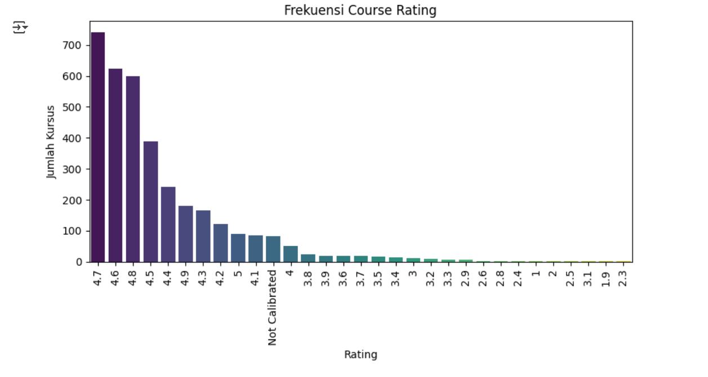
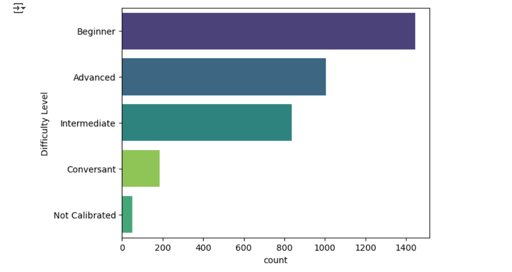

# Laporan Recommender System Project - Margareth Serepine
## **Project Overview**
Pandemi Covid-19 pada tahun 2021 memicu lonjakan besar dalam penggunaan MOOC (Massive Open Online Courses). Dengan melimpahnya kursus online dari berbagai institusi dan platform, banyak pelajar mengalami kesulitan dalam menghadapi tantangan dalam menemukan kursus yang paling sesuai dengan kebutuhan dan tingkat keterampilan mereka. 

Menurut penelitian Hew et al. (2020), retensi pelajar dalam MOOC dapat diprediksi menggunakan algoritma machine learning, yang mengindikasikan adanya pola perilaku pengguna yang dapat dimanfaatkan untuk memberikan rekomendasi pembelajaran yang lebih personal dan relevan. Di sisi lain, Jordan (2015) melaporkan bahwa rata-rata tingkat penyelesaian kursus MOOC sangat rendah, berkisar antara 5–15%, yang menyoroti pentingnya keterlibatan dan kecocokan kursus dengan minat serta kemampuan peserta.

Menanggapi tantangan ini, Khalil dan Ebner (2014) menunjukkan bahwa sistem rekomendasi mampu meningkatkan pengalaman pengguna dalam platform MOOC dengan menyediakan konten yang lebih sesuai dengan preferensi dan kebutuhan individu. 

Oleh karena itu, penerapan sistem rekomendasi berbasis machine learning dalam konteks pendidikan daring tidak hanya relevan, tetapi juga sangat krusial untuk meningkatkan efektivitas pembelajaran, retensi pengguna, dan keberhasilan penyelesaian kursus. Sistem rekomendasi ini akan membantu pengguna memilih kursus dengan cara yang lebih personal dan efisien, terutama berdasarkan informasi deskripsi kursus, keterampilan, dan tingkat kesulitan.

**Referensi:**  
[1]K. F. Hew, X. Hu, C. Qiao, dan Y. Tang, “Predicting learners' retention in MOOCs using machine learning,” Computers & Education, vol. 151, p. 104597, 2020. [[Online]](https://doi.org/10.1016/j.compedu.2020.104597)  
[2]K. Jordan, “MOOC completion rates: The data,” 2015. [[Online]](https://www.katyjordan.com/MOOCproject.html)  
[3]H. Khalil dan M. Ebner, “MOOCs Completion Rates and Possible Methods to Improve Retention – A Literature Review,” Int. J. Emerging Technol. Learn. (iJET), vol. 9, Special Issue 1, pp. 19–26, 2014. [[Online]](https://doi.org/10.3991/ijet.v9iSpecialIssue1.3358)  

## **Business Understanding**
### Problem Statements
1. Bagaimana cara merekomendasikan kursus yang relevan dengan kebutuhan dan keterampilan pengguna?
2. Bagaimana sistem dapat menyesuaikan rekomendasi berdasarkan tingkat kesulitan kursus yang sesuai dan diinginkan oleh pengguna?

### Goals
1. Membangun sistem rekomendasi kursus yang relevan berdasarkan konten kursus seperti nama, deskripsi, keterampilan, dan tingkat kesulitan yang sesuai dengan minat serta kebutuhan pengguna.
2. Menyediakan rekomendasi kursus yang bervariasi dan memiliki cakupan yang luas, serta menyarankan kursus baru yang mungkin belum populer.

### Solution Approach
- Content-Based Filtering  : Pada metode ini sistem mencari kursus serupa dengan yang pernah dipilih berdasarkan deskripsi dan atribut kursus lainnya menggunakan teknik TF-IDF dan cosine similarity.

## **Data Understanding**
### Dataset
Proyek ini menggunakan dataset "Coursera Courses Dataset 2021" yang berasal dari Kaggle dan dapat diakses melalui [Link Berikut](https://www.kaggle.com/datasets/khusheekapoor/coursera-courses-dataset-2021).

Dataset ini berisi informasi tentang nama kursus, universitas penyedia kursus, tingkat kesulitan, deskripsi dan penjelasan lainnya mengenai kursus yang disediakan. Dataset ini dapat digunakan dalam sistem rekomendasi untuk mempromosikan kursus Coursera berdasarkan tingkat Kesulitan dan keterampilan yang dibutuhkan.

Dataset ini terdiri dari 3.522 baris dan 7 kolom . 
- 3.522 baris (rows): merepresentasikan kursus yang tersedia di platform Coursera.
- 7 kolom (columns): merepresentasikan fitur (kolom) atau atribut dari kursus yang tersedia.

### Data Feature 
Adapun fitur (kolom) yang terdapat pada dataset ini, yaitu:
 1. Course Name: Nama kursus,
 2. University: Universitas yang menawarkan Kursus,
 3. Difficulty Level: Tingkat kesulitan kursus,
 4. Course Rating: Nilai rating kursus dalam skala 0 - 5,
 5. Course URL: Tautan ke halaman kursus,
 6. Course Description: Deskripsi kursus,
 7. Skills: Keterampilan yang terkait dengan kursus.

Dataset ini semula tidak memiliki missing value secara eksplisit, namun terdapat keterangan dimana nilai seperti "Not Calibrated" dianggap sebagai missing value.

### Data Checking 
- Check Missing Value : Mengecek nilai yang hilang (kosong). Melalui pengecekan data secara normal tanpa mengubah nilai apapun, dideteksi tidak ada data yang hilang atau memiliki nilai yang kosong. Namun karena pada dataset sudah terdapat keterangan bahwa  "Not Calibrated" dianggap sebagai nilai yang hilang. Melalui tahap ini dicek berapa total data yang memiliki nilai "Not Calibrated". 
Banyak data yang memiliki nilai "Not Calibrated" diantaranya:
    1. 50 nilai "Not Calibrated" pada kolom "Difficulty Level" 
    2. 82 nilai "Not Calibrated" pada Kolom "Course Rating" 
- Check Duplicates : Mengecek baris yang duplikat. Melalui pengecekan data, terdapat ada 98 baris data yang terdeteksi sebagai duplikat.

### Univariate Exploratory Data Analysis
Melalui tahap ini, dilakukan analisis visualisasi dari beberapa fitur yang dibutuhkan.  
**1. Visualisasi Course Rating**

Distribusi hasil :
 * Dominasi Rating Positif : Rating 4.7, 4.6, dan 4.8 merupakan yang nilai yang paling sering muncul, masing-masing dengan jumlah kursus lebih dari 600. Hal ini mencerminkan bahwa mayoritas kursus memiliki tingkat kepuasan pengguna yang sangat tinggi. Platform kemungkinan besar berhasil mempertahankan standar kualitas yang baik dalam penyediaan kursus.
* Minimnya Kursus dengan Rating Rendah : Kursus dengan rating di bawah 4.0 jumlahnya sangat sedikit dibandingkan dengan kursus yang memiliki rating tinggi. Menunjukkan bahwa kursus dengan kualitas rendah mungkin sudah dihapus, atau pengguna memang jarang memilih kursus yang tidak populer.
* Nilai "Not Calibrated" : Sebanyak 82 data yang memiliki label "Not Calibrated" yang artinya tidak memiliki rating. Dimana data ini secara khusus akan diganti nilainya menjadi NaN supaya dapat terdeteksi menjadi nilai yang kosong.
* Distribusi Miring Positif (Right Skewed) : Distribusi data condong ke rating tinggi yang artinya sebagian besar kursus dinilai sangat baik, sementara hanya sedikit yang mendapat rating rendah.

**2. Analisis Fitur Nama Kursus dan Universitas**
- Fitur Course Name (Nama) : Total 3.416 kursus unik yang dicatat dalam kolom ini dengan kursus paling populer yaitu "Google Cloud Platform Fundamentals: Core Infrastructure" yang muncul sebanyak 8 kali. Sebagian besar kursus hanya muncul sekali, menunjukkan bahwa mayoritas kursus bersifat unik. Platform memiliki beragam topik kursus, menunjukkan variasi yang besar.
- Fitur University (Universitas) : Terdapat 184 institusi/universitas yang menawarkan kursus. Dengan 5 universitas teratas yaitu Coursera Project Network sebanyak 562 kursus, University of Illinois at Urbana-Champaign sebanyak 138 kursus, Johns Hopkins University sebanyak 110 kursus, University of Colorado Boulder sebanyak 101 kursus, dan University of Michigan sebanyak 101 kursus. Banyak universitas/institusi hanya memiliki 1 kursus yang menandakan keragaman kontributor dalam platform ini.

**3. Visualisasi Fitur Difficulty Level**

Distribusi hasil :
- Beginner (Pemula) merupakan tingkat kesulitan yang paling banyak, dengan jumlah lebih dari 1400 kursus. Hal ini menunjukkan bahwa platform ini sangat ramah bagi pemula.
- Advanced dan Intermediate juga memiliki representasi yang tinggi, masing-masing mendekati 1000 dan 850 kursus, menandakan adanya banyak kursus untuk pengguna yang sudah memiliki pengetahuan menengah hingga lanjut.
- Conversant (cukup menguasai) memiliki jauh lebih sedikit kursus (~200), menunjukkan bahwa label ini tidak banyak digunakan oleh pengguna/instruktur dan penyedia kursus
- Not Calibrated berjumlah sangat sedikit, yang merupakan data tidak lengkap (missing value), dan perlu ditangani pada tahap selanjutnya.

## **Data Preparation**
Beberapa teknik data preparation yang dilakukan adalah:
### Data Cleaning 
- Mengubah nilai 'Not Calibrated' : Data yang terdeteksi sebagai nilai "Not Calibrated" diganti menjadi NaN supaya saat mendeteksi 'missing value' jumlahnya dapat terdeteksi oleh sistem. Setelah nilai diubah, tampilan menunjukkan bahwa total missing value pada data sebanyak :    
    - 50 buah pada fitur `Difficulty Level`
    - 82 buah pada fitur `Course Rating`
- Mengganti Tipe Data Fitur Course Rating : Mengganti tipe data Course Rating menjadi float untuk memastikan data dapat dianalisis, divisualisasikan, dan digunakan dalam algoritma machine learning yang memerlukan input numerik.
- Penanganan Missing Value pada Fitur Course Rating : Untuk mengatasi missing value pada kolom Course Rating dilakukan pengubahan nilai, yaitu mengganti nilai yang dideteksi sebagai missing value menggunakan nilai median dari seluruh data pada kolom tersebut.
- Penanganan Missing Value pada Fitur Difficulty Level : Untuk mengatasi missing value pada kolom Difficulty Level dilakukan pengubahan nilai yaitu mengganti missing value menggunakan nilai modus (mode) dari kolom tersebut karena nilai yang paling sering muncul (modus) mewakili sebagian besar data, sehingga aman digunakan sebagai pengganti nilai yang hilang.
- Menghapus Data Duplikat : Menghapus semua data yang terdeteksi duplikat
- Menghapus Karakter Khusus : Menghapus atau mengganti karakter-karakter khusus pada kolom teks dengan spasi, agar teks lebih bersih dan mudah diproses lebih lanjut untuk pemodelan.

### Text Feature Transformation
- Fitur Gabungan Representasi Teks : Menggabungkan beberapa kolom seperti Course Name, Course Description, Skills, dan Difficulty Level ke dalam satu kolom baru bernama Final Col yang akan digunakan sebagai fitur input pada sistem rekomendasi berbasis content-based filtering.
- Ekstraksi Fitur Teks : Mengonversi kolom Final Col menjadi fitur numerik berbobot menggunakan TF-IDF untuk memungkinkan pemodelan kemiripan antar kursus berdasarkan deskripsi, nama, skill, dan tingkat kesulitan.

## **Modeling**
### Similarity Calculation
Menghitung kemiripan antar kursus berdasarkan hasil ekstraksi fitur TF-IDF dari kolom Final Col, yang telah merepresentasikan informasi gabungan dari beberapa fitur

### Index Mapping
Membuat pemetaan antara 'Course Name' dengan indeks baris dalam DataFrame. untuk membantu mengambil posisi kursus tertentu dalam matriks kemiripan berdasarkan nama kursus yang diberikan oleh pengguna.

### Course Recommendation
Menghasilkan rekomendasi kursus berdasarkan kursus yang dipilih pengguna deengan memanfaatkan matriks kesamaan kosinus (cosine_sim_matrix) untuk mencari kursus-kursus lain yang paling mirip berdasarkan konten deskriptif yang sudah ditransformasikan ke dalam bentuk numerik dengan TF-IDF. 

Seperti pada contoh `get_recommendations('Finance for Managers')` :  Memberikan saran kursus yang relevan berdasarkan isi materi dan kesamaan fitur deskriptifnya, misalnya argumen Finance for Managers, yang berarti merekomendasikan kursus lain yang mirip dengan kursus berjudul Finance for Managers, berdasarkan kemiripan konten yang dihitung menggunakan cosine similarity,berdasarkan fitur gabungan di kolom Final Col.

**Kelebihan :** 
1. Pendekatan content-based hanya bergantung pada deskripsi fitur item seperti Course Name, Description, Skills, dan Difficulty Level, sehingga tetap bisa bekerja walau data interaksi pengguna (seperti rating eksplisit atau riwayat kursus yang diambil) tidak tersedia.
2. Sistem memberikan rekomendasi berdasarkan kemiripan konten dengan kursus yang telah dipilih pengguna. Ini membuat rekomendasi lebih relevan secara semantik.
3. Pendekatan ini cukup mudah ditelusuri dan dijelaskan. Misalnya: "kursus ini direkomendasikan karena memiliki topik atau tingkat kesulitan yang mirip dengan kursus pilihanmu."
4. TF-IDF dan cosine similarity cukup efisien dalam skala dataset kecil hingga sedang (seperti dataset 3.812 baris yang kamu gunakan), serta bisa berjalan cepat tanpa memerlukan pelatihan model berat.

**Kekurangan :**
1. Kursus baru dengan deskripsi singkat atau tidak lengkap akan sulit direkomendasikan karena TF-IDF sangat tergantung pada kata-kata yang ada di deskripsi.
2. Karena tidak melibatkan data historis pengguna (seperti rating atau aktivitas), model tidak bisa belajar dari preferensi nyata pengguna dan hanya menebak berdasarkan konten.
3. Sistem cenderung merekomendasikan kursus yang sangat mirip secara tekstual, sehingga pengguna bisa merasa rekomendasi kurang bervariasi.
4. TF-IDF tidak memahami sinonim atau makna kontekstual. Misalnya, kursus yang menggunakan kata "AI" bisa tidak dianggap mirip dengan kursus yang menggunakan kata "Artificial Intelligence", jika kata tersebut tidak banyak muncul bersamaan.

## **Evaluation**
### Metrik Evaluasi yang Digunakan
Dalam proyek ini digunakan dua metrik evaluasi utama untuk menilai performa sistem rekomendasi berbasis konten, yaitu: 
- Coverage : Mengukur seberapa banyak item (kursus) dalam dataset yang muncul minimal satu kali dalam hasil rekomendasi. Sistem menghitung semua rekomendasi dari seluruh kursus, lalu menghitung proporsi kursus yang pernah direkomendasikan terhadap jumlah kursus total.
- Novelty : Mengukur sejauh mana rekomendasi yang diberikan bersifat baru atau tidak populer. Sistem menghitung frekuensi kemunculan tiap kursus dalam semua hasil rekomendasi. Semakin jarang muncul, semakin tinggi skor novelty-nya.

Metrik ini dipilih karena sesuai dengan tujuan awal, yaitu tidak hanya memberikan rekomendasi yang relevan dan sesuai tingkat kesulitan, tetapi juga memastikan bahwa rekomendasi mencakup banyak kursus dan menawarkan kursus baru yang belum populer.

Selain itu, pemilihan Coverage dan Novelty sangat tepat dalam konteks sistem rekomendasi Coursera berbasis konten, dimana:
1. Sistem diharapkan menyediakan kursus yang relevan dan sesuai dengan minat dan keterampilan pengguna, termasuk tingkat kesulitan.
2. Sistem juga harus mampu menyarankan beragam pilihan (tidak monoton) dan mendorong penemuan kursus baru oleh pengguna.

Dengan demikian, kedua metrik ini secara langsung mengukur luas cakupan dan tingkat kebaruan rekomendasi yang dihasilkan sistem.

### Berdasarkan Metrik Evaluasi
Berdasarkan hasil, sistem rekomendasi yang dibangun menunjukkan performa sebagai berikut:
1. Coverage: 91.74%  
Sistem berhasil merekomendasikan sekitar 91.74% dari seluruh kursus yang tersedia dalam dataset. Ini menunjukkan bahwa sistem memiliki jangkauan yang luas dalam memberikan rekomendasi dan tidak hanya fokus pada kursus tertentu saja.
2. Novelty Score: 12.0319  
Skor ini menunjukkan bahwa sistem memberikan rekomendasi yang tergolong tidak populer atau belum umum, yang artinya sistem mendorong pengguna untuk menemukan kursus baru yang mungkin belum dikenal sebelumnya.
